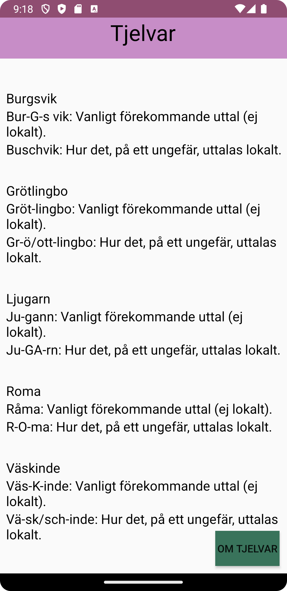

# Rapport

Har skapat en RecyclerView som ska visa upp namn på olika orter på Gotland som hämtas in via en URL.
För att kunna ta emot datan i URL:en har en Locations-klass skapats som endast tar emot namn, id,
vanligt uttal, och faktiskt uttal.
Internetåtkomst har tillåtits, och för att kunna visa datan i RecyclerView har en RecyclerViewAdaper
skapats. Då datan inte kan visas upp direkt, måste datan parsas ut vilket görs genom Gson som parsar
ut JSON-datan från URL:en. I kodexemplet nedan möjliggörs parsning av JSON-datan via Gson, och
nedanför detta ser vi klassen som hanterar och tar emot informationen om orterna, se nedan.

En About-sida har lagts till som en intern webbsida (html), och åtkomst till denna fås via en knapp
på förstasidan. Aktiviteten för denna interna sida tar emot html-dokumentets "location" (fungerar '
som URL), och visas sedan upp i aktiviteten.

```
@Override
    protected void onCreate(Bundle savedInstanceState) {
        super.onCreate(savedInstanceState);
        setContentView(R.layout.activity_main);

        // RecyclerView and adapter
        RecyclerView recyclerView = findViewById(R.id.recyclerView);
        recyclerView.setLayoutManager(new LinearLayoutManager(this));

        adapter = new RecyclerViewAdapter(this, locations, new RecyclerViewAdapter.OnClickListener() {
            @Override
            public void onClick(Locations locations) {
                Toast.makeText(MainActivity.this, locations.getName(), Toast.LENGTH_SHORT).show();
            }
        });
        recyclerView.setAdapter(adapter);

        //new JsonFile(this, this).execute(JSON_FILE);
        new JsonTask(this).execute(JSON_URL);

        //Button on first page
        Button b = findViewById(R.id.button);
        b.setOnClickListener(new View.OnClickListener() {
            @Override
            public void onClick(View view) {
                Intent intent = new Intent(MainActivity.this, MainActivity3.class);
                startActivity(intent);
            }
        });
    }

    @Override
    public void onPostExecute(String json) {
        Gson gson = new Gson();
        Type type = new TypeToken<ArrayList<Locations>>() {}.getType();
        ArrayList<Locations> listOfLocations = gson.fromJson(json, type);
        locations.addAll(listOfLocations);
        adapter.notifyDataSetChanged();
    }
```

Bilder läggs i samma mapp som markdown-filen.




Läs gärna:

- Boulos, M.N.K., Warren, J., Gong, J. & Yue, P. (2010) Web GIS in practice VIII: HTML5 and the canvas element for interactive online mapping. International journal of health geographics 9, 14. Shin, Y. &
- Wunsche, B.C. (2013) A smartphone-based golf simulation exercise game for supporting arthritis patients. 2013 28th International Conference of Image and Vision Computing New Zealand (IVCNZ), IEEE, pp. 459-464.
- Wohlin, C., Runeson, P., Höst, M., Ohlsson, M.C., Regnell, B., Wesslén, A. (2012) Experimentation in Software Engineering, Berlin, Heidelberg: Springer Berlin Heidelberg.